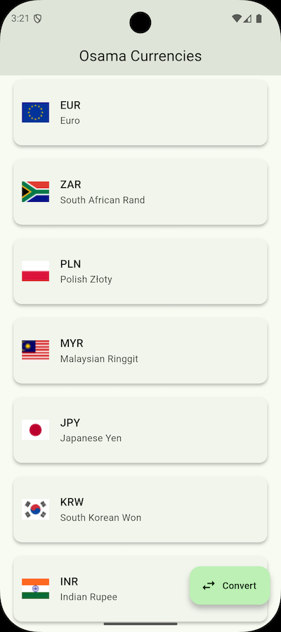
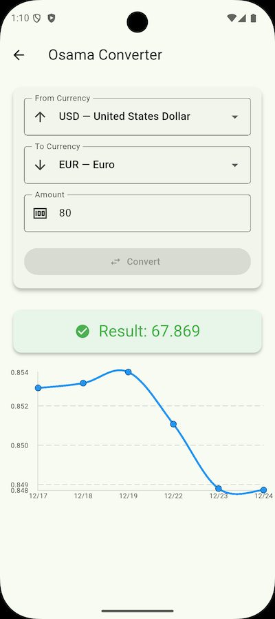

# 💱 Osama Currency Converter App (Flutter)

A Flutter-based currency converter application that allows users to view supported currencies, convert between currencies, and visualize historical exchange rates for the last 7 days.

---

## 📱 Features

### 1️⃣ Supported Currencies List

* Displays a list of supported currencies.
* Each currency shows its **country flag**.
* Data is fetched from a remote API **once**, then **cached locally**.
* Subsequent app launches load data from the local database for faster access.

### 2️⃣ Currency Converter

* Select **From** and **To** currencies.
* Enter an amount to convert.
* Live validation for user inputs.
* Displays conversion result clearly.

  

### 3️⃣ Historical Exchange Rates (Last 7 Days)

* Fetches historical data for the selected currency pair.
* Displayed as a **line chart**.
* Activated **after the user selects two currencies and presses convert** in the converter screen.
* Optimized axis labels to prevent overlapping.

  

  
---

## 🌐 APIs Used

### Currency Data API

**Frankfurter API**

https://api.frankfurter.app

markdown
Copy code

> ⚠️ Initially planned to use `free.currencyconverterapi.com`, but it was not usable without a paid plan.
> Frankfurter API was selected as a **free, reliable alternative**.

### Country Flags

**FlagCDN**

https://flagcdn.com/

---

## 🛠️ Technology Stack

* **Flutter (Dart)**
* **Bloc (flutter_bloc)**
* **Hive (Local Database)**
* **Dio (Networking)**
* **GetIt + Injectable (Dependency Injection)**
* **CachedNetworkImage (Image loading)**
* **Material Design 3**

---

## 🧱 App Architecture

### 🔹 Clean Architecture + Bloc Pattern

The app follows **Clean Architecture**

### ✅ Why Clean Architecture?

* Separation of concerns
* Easier testing
* Scalable & maintainable
* UI independent from business logic

### ✅ Why Bloc?

* Predictable state management
* Clear event → state flow
* Easy testing

---

## 🖼️ Image Loader Library

### **CachedNetworkImage**

**Why chosen?**

* Automatic image caching
* Reduces network calls
* Smooth scrolling performance
* Built-in loading & error handling

Used for loading country flags efficiently.

---

## 🗄️ Local Database

### **Hive**

**Why Hive?**

* Very fast (NoSQL, binary storage)
* Lightweight
* No native dependencies
* Perfect for offline caching
* Easy integration with Flutter

**Usage:**

* Cache currencies list after first API call
* Load currencies locally on future app launches

---

## 🧪 Unit Testing

### Implemented Tests

* Unit test for **Get Currencies** feature
* API integration tests (mocked)
* Repository logic tests
* Bloc business logic tests

**Tools used:**

* `flutter_test`
* `mocktail`

---

## 🧩 Dependency Injection

### **GetIt + Injectable**

**Why chosen?**

* Simple & powerful service locator
* Compile-time safety with `injectable`
* Clean constructor-based injection
* Easy testing & mocking

All services, use cases, repositories, and blocs are registered in a centralized DI container.

---

## 🎨 UI & Design

* Built using **Google Material Design (Material 3)**

---
